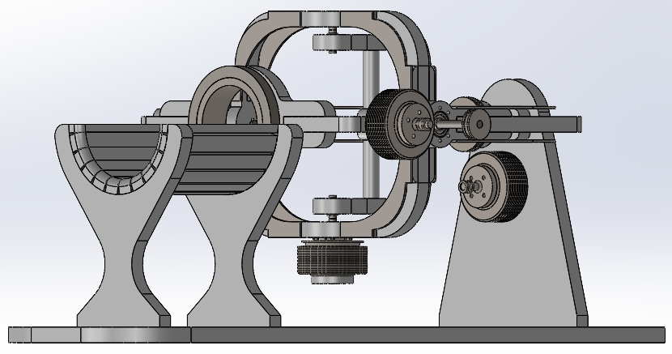

# WristMechanics

**WristMechanics** contains the SolidWorks CAD models, kinematic and dynamic analyses, and Simscape Multibody implementation of the **Wrist Rehabilitation Robot (WRR)** manipulator.

---

<p align="center">
  
</p>

---

## Installation

WristMechanics depends on the [ManiDyn](https://github.com/BanaanKiamanesh/ManiDyn) toolbox and its required dependencies.

Before using this repository, complete the installation procedure described in the ManiDyn documentation. Then clone this repository and run the installation script from MATLAB:

```matlab
cd <path_to>/WristMechanics
install('save')
```

For additional information, refer to the documentation in `install.m`.

> [!IMPORTANT]
> WristMechanics requires a properly installed and configured version of **ManiDyn**. The project will not function without it.


## CAD Models

The `solidworks` directory contains:

- SolidWorks part (`.SLDPRT`) and assembly (`.SLDASM`) files
- STEP exports of the robot

Two STEP model variants are provided:

- **Detailed** – Includes all mechanical components.
- **General** – Contains only the primary robot links for simulation and modeling.

All CAD models were designed and exported using **SolidWorks 2025**.


## Kinematics and Dynamics

The symbolic kinematic and dynamic models are generated by the scripts in the `motion` directory.

Run:

- `WristKinematics.m`
- `WristDynamics.m`

These scripts compute the robot's kinematic and dynamic equations and export the resulting matrices in multiple formats supported by **ManiDyn**.

For additional information, see the `ReturnFormat` documentation in ManiDyn.


## Examples

Several example projects are included:

- **Simscape Multibody Templates**
  - Contains both the detailed and simplified Simscape Multibody models.
  ```matlab
  >> sim examples/empty/WristEmptyDetailed.slx % a detailed imp
  >> sim examples/empty/WristEmptyGeneral.slx  % a simplified imp
  ```

- **Parameter Identification**
  - Recursive Least Squares (RLS)-based identification of unknown robot dynamic parameters.
  ```matlab
  >> sim examples/identification/WristIdentScheme.slx
  ```

- **Control**
  - Model-based inverse dynamics control.
  ```matlab
  >> sim examples/control/WristControlScheme.slx
  ```

- **Model Validation**
  - Comparing the derived equations of motion against the Simscape model.
  ```matlab
  >> sim examples/validation/WristValidationScheme.slx
  ```

All example models were developed using **MATLAB R2025b**.


## License

This project is released under the terms of the **MIT License**. See the [LICENSE](LICENSE) file for details.
